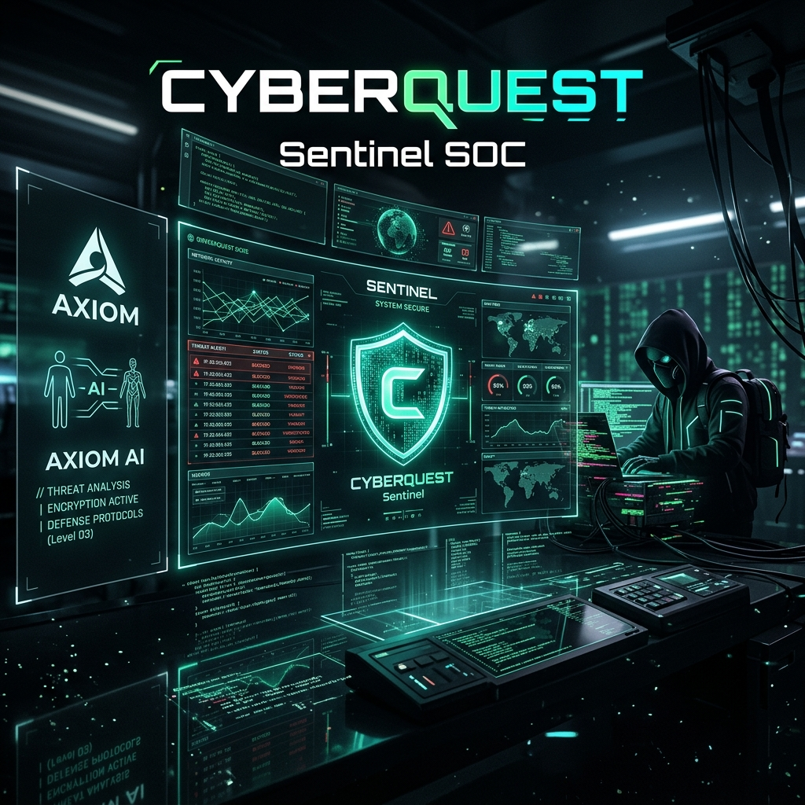

# CipherOS: Sentinel SOC 🛡️

A high-fidelity cybersecurity learning environment and SOC (Security Operations Center) simulator.



## 🛡️ Overview

Welcome to **Sentinel SOC**, a gamified simulation environment designed to train and test Cyber-Defense Operators. In this immersive experience, you step into the role of a SOC Analyst, monitoring real-time threats, navigating system breaches, and interacting with AI-driven advisors to protect the network.

## 🚀 Key Features

- **Interactive Terminal**: A recursive, retro-themed command interface for mission control.
- **Active Threat Dashboard**: Monitor incoming alerts, malicious CIDRs, and system vulnerabilities in real-time.
- **AI-Driven Assistance**: 
    - **AXIOM**: Your defensive heuristic engine providing tactical advice.
    - **MENTOR**: Guided learning for complex security concepts.
- **Skill Progression**: Track your expertise in Forensics, Malware Analysis, Phishing Defense, and Web Security.
- **Onboarding Experience**: Personalized diagnostic sequence to determine your analyst tier.
- **Adversarial Engine**: Face off against **CIPHER**, a rogue threat actor with dynamic intrusion patterns.

## 🛠️ Tech Stack

- **Framework**: [React 19](https://react.dev/)
- **Build Tool**: [Vite 6](https://vitejs.dev/)
- **Styling**: [Tailwind CSS 4](https://tailwindcss.com/)
- **Animations**: [Motion](https://motion.dev/) (Framer Motion)
- **Icons**: [Lucide React](https://lucide.dev/)
- **AI Core**: AMD Cloud API (Llama 3-8B) with local personality fallbacks.

## 💻 Running Locally

### Prerequisites
- [Node.js](https://nodejs.org/) (Latest LTS)
- npm or yarn

### Setup
1. Clone the repository.
2. Install dependencies:
   ```bash
   npm install
   ```
3. (Optional) Configure environment variables:
   Create a `.env` file and add your AMD endpoint:
   ```env
   VITE_AMD_ENDPOINT=https://your-api-endpoint.com
   ```
4. Start the development server:
   ```bash
   npm run dev
   ```

## 🌐 Deployment

The project is configured for deployment via Vite. Run `npm run build` to generate the production bundle.

---
*Built with precision for the next generation of cybersecurity professionals.*
