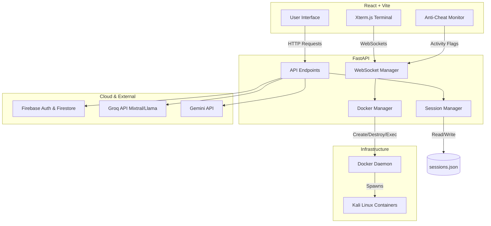

# CyberQuest // CipherOps

An advanced, sandboxed cybersecurity training platform that combines interactive **Kali Linux container environments** with a **multi-agent AI ecosystem** and real-time **anti-cheat behavioral monitoring**.

---

## 🚀 Key Features

*   **Sandboxed Terminal (Vite + React + Xterm.js):** Connects to a secure Kali Linux Docker container in real-time via WebSockets.
*   **Persistent User Volumes:** Maintains the user's filesystem and shell scrollback history across disconnects and resumes.
*   **Multi-Agent AI System:**
    *   **Agent Adversary (Groq/Mixtral):** Generates realistic cyber attack scenarios and vulnerabilities (CVE-style).
    *   **Agent Architect (Gemini 1.5):** Compiles objectives, mission briefings, and guidelines into internal organization emails.
    *   **Agent Colleague (Groq/Llama-3):** Offers contextual hints matched to the user's skill level.
    *   **Agent Evaluator (Gemini 1.5):** Scores submissions and calculates profile progression dynamically.
    *   **Assessment Agent (Gemini 1.5):** Generates custom entrance assessments and ranks initial users from Novice to Elite.
*   **Anti-Cheat Behavioral Engine:** Logs tab switches, keyboard shortcut violations, copy/paste commands, resize events, and potential DevTools activity.
*   **Firebase Integration:** Secures routes using Firebase Authentication and stores user stats, ranks, and logs persistently in Firestore.

---

## 🛠️ Architecture


```mermaid
graph TD
    subgraph Frontend [React + Vite]
        UI[User Interface]
        Terminal[Xterm.js Terminal]
        AntiCheat[Anti-Cheat Monitor]
    end

    subgraph Backend [FastAPI]
        API[API Endpoints]
        WS[WebSocket Manager]
        DockerMgr[Docker Manager]
        SessionMgr[Session Manager]
    end

    subgraph Cloud & External
        Firebase[Firebase Auth & Firestore]
        Groq[Groq API Mixtral/Llama]
        Gemini[Gemini API]
    end

    subgraph Infrastructure
        DockerDaemon[Docker Daemon]
        Kali[Kali Linux Containers]
    end

    UI -->|HTTP Requests| API
    Terminal -->|WebSockets| WS
    AntiCheat -->|Activity Flags| WS
    API --> Firebase
    WS --> DockerMgr
    DockerMgr -->|Create/Destroy/Exec| DockerDaemon
    DockerDaemon -->|Spawns| Kali
    API --> SessionMgr
    SessionMgr -->|Read/Write| JSONStore[(sessions.json)]
    API --> Groq
    API --> Gemini
```

---

## 📂 Project Structure

```text
cipherops/
├── backend/
│   ├── main.py              # FastAPI server entry point and WebSocket setup
│   ├── core/
│   │   ├── auth.py          # Firebase token validator & DEV mode bypass
│   │   ├── docker_manager.py # Kali container lifecycle & watchdog thread
│   │   ├── firestore_client.py # User profile and rank progression client
│   │   └── session_manager.py # session.json read/write & state machine
│   └── agents/
│       ├── adversary.py     # Attack vector generator (Groq)
│       ├── architect.py     # Mission template creator (Gemini)
│       ├── colleague.py     # Nudging hint generator (Groq)
│       ├── evaluator.py     # Post-mission grading (Gemini)
│       └── assessment.py    # Initial skill ranking (Gemini)
├── frontend/
│   ├── src/
│   │   ├── components/      # UI components (Terminal, Mail, Login, Assessment, etc.)
│   │   ├── App.jsx          # App layout and state management
│   │   ├── api.js           # API request helpers
│   │   └── firebase.js      # Firebase SDK client initialization
│   ├── package.json         # React project dependencies (Vite, Xterm, Firebase)
│   └── tailwind.config.js   # Tailwind theme customizations
└── .gitignore               # Ensures node_modules, .env, and certificates stay local
```

---

## 🔧 Installation & Setup

### Prerequisites

1.  **Docker Desktop** (must be running on the host system).
2.  **Node.js & npm**.
3.  **Python 3.10+**.

---

### Backend Setup

1.  Navigate to the `backend` folder:
    ```bash
    cd backend
    ```
2.  Install dependencies:
    ```bash
    pip install fastapi uvicorn docker google-generativeai groq python-dotenv firebase-admin
    ```
3.  Create a `.env` file in the root `cipherops` folder and configure your API keys:
    ```ini
    # Root .env configuration
    GROQ_API_KEY=your_groq_api_key
    GEMINI_API_KEY=your_gemini_api_key
    ```
4.  *(Optional)* Place your Firebase `firebase-service-account.json` in the root directory to enable Firestore integration. Without it, the backend automatically defaults to in-memory/stub mode.
5.  Pull the default Kali Linux Docker image:
    ```bash
    docker pull kalilinux/kali-rolling
    ```
6.  Start the FastAPI server:
    ```bash
    uvicorn backend.main:app --reload --host 0.0.0.0 --port 8000
    ```

---

### Frontend Setup

1.  Navigate to the `frontend` folder:
    ```bash
    cd ../frontend
    ```
2.  Install packages:
    ```bash
    npm install
    ```
3.  Create a `.env` file in the `frontend` folder with your Firebase web client configuration:
    ```ini
    VITE_FIREBASE_API_KEY=your_api_key
    VITE_FIREBASE_AUTH_DOMAIN=your_auth_domain
    VITE_FIREBASE_PROJECT_ID=your_project_id
    VITE_FIREBASE_STORAGE_BUCKET=your_storage_bucket
    VITE_FIREBASE_MESSAGING_SENDER_ID=your_sender_id
    VITE_FIREBASE_APP_ID=your_app_id
    ```
4.  Run the development build server:
    ```bash
    npm run dev
    ```
5.  Access the web console locally at `http://localhost:5173`.
